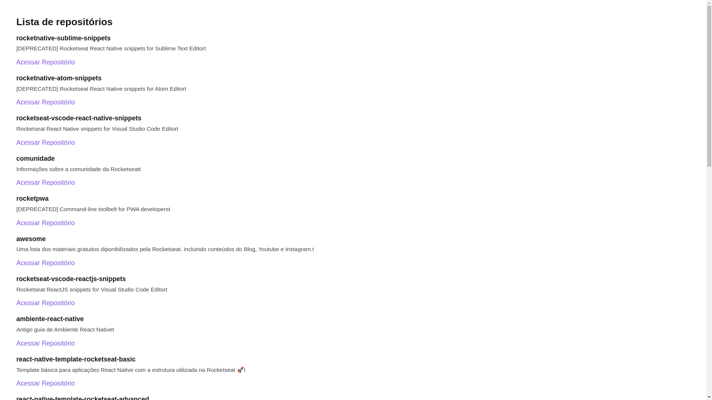

# Github Explorer
## React fundamentals
### Module 1 - RocketSeat - Ignite ReactJS 🔥

<p>
  
  
  <a href="https://opensource.org/licenses/MIT">
    
  </a>
</p>

## About The project
Base Structure of an application that intends to use the giub API and show a list of React application applications.

## Technologies
- [Webpack](https://webpack.js.org/)
- [Webpack Dev Server](https://github.com/webpack/webpack-dev-server)
- [Source Maps](https://webpack.js.org/configuration/devtool/)
- [Babel](https://babeljs.io/)
- [SASS](https://sass-lang.com/)
- [Fast Refresh](https://github.com/pmmmwh/react-refresh-webpack-plugin/)
- [TypeScript](https://www.typescriptlang.org/)

## Project Images


## ⚙️ Running The Project
```
# Clone this repository
$ git clone https://github.com/jorgeeder/github-explorer
# or use the download option.

# Access the dtmoney folder
$ cd github-explorer

# Install the dependencies
$ yarn install
or
$ npm install

# Running the Project
$ yarn dev
or
$ npm dev

# Access http://localhost:8080 in your browser

# if you want to change the list of repositories to be shown change the RepositoryList function in the 
# file: ./src/components/RepositoryList.tsx

# format for user repositories:
# https://api.github.com/users/jorgeeder/repos

# format for organization repositories:
# https://api.github.com/orgs/rocketseat/repos
```


Made with 💜 by [Jorge Eder](https://github.com/jorgeeder)

<p>
  <a href="https://www.linkedin.com/in/jorgeeder/">
      
  </a>
  <a href = "mailto:jorgeeder.dev@gmail.com">
  
  </a>
</p>
